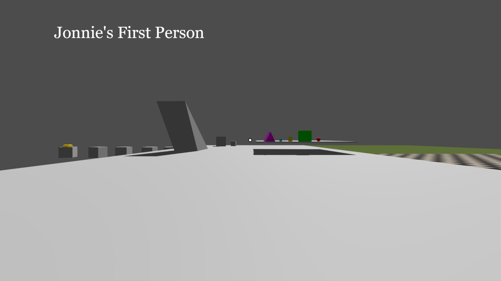

# Jonnie's First Person

*Hey look another first person controller for Godot!*

Well this one is mine so it's probably terrible.

This is a heavily modified fork of Linko's Simple First Person Controller for Godot.

https://github.com/Linko-3D/Godot-Simple-First-Person-Controller

I added QOL improvements, as well as things I thought other Godot FPS controllers lacked.

# Things I added

- **Export Variables** for node referencing, player settings, advanced player settings, footstep, interact and input settings. This should keep child nodes modular without breaking dependencies, as well as add more user customization control

- **Plugin** that when enabled will automatically set up all of the input mapping (No longer do you need to manually do this yourself every time you grab a new controller from the asset library!)

- **Gamepad Support**

- **Motion Blur**, with adjustable strength, samples and smoothing *(experimental. disabled by default)*

- **Motion and Input Smoothing** for mouse and gamepad

- ***Head Bob*** *(everybody loves head bob)*

- A simple **Pause Menu** to resume or quit the game from

- **Footstep Type Detection** using FootstepsBody3D and FootstepsResource

- **Interaction System** with any CollisionBody3D

- Ability to **Pickup and Throw RigidBody3Ds**, with adjustable settings for max carry weight and throw force

- A **Smaller Reticle** (2px x 2px) for a more modern feel

- A **Demo Project**!

Created by Jonnie Gieringer
